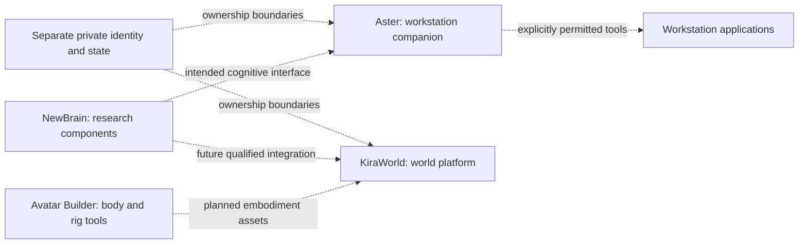

# Architecture map and glossary

**A map of roles and intended boundaries, not a claim that every connection is implemented.**  
Prepared October 8, 2026. See the [public audience Q&A](../presentation/Audience-Questions.txt) and [reviewed results](../presentation/Reviewed-Results.txt) for current evidence.

## Roles at a glance

| Name | Role | Current boundary |
| --- | --- | --- |
| **NewBrain** | A research family of separate fitted-cell, circuit, learning and persistence studies; intended future cognitive core for Aster. | Narrow component results exist. The small command learner is not connected to the original spiking circuit or Kira conversation. General conversation and full integration remain unfinished. |
| **Aster** | Robert's local-first workstation-companion project, inspired by E.V., with a female voice as a design goal. | Deterministic file, memory and job mechanisms exist in private source. An intended NewBrain-only cognitive core must expose a qualified interface; current source inspection does not establish a conversational connection. No hidden Qwen reasoning fallback is intended. A qualified public executable and permitted voice asset are not available in this package. |
| **Avatar Builder** | Tools and experiments for constructing and checking bodies, geometry and rigs. | Saved rest-state preservation has accepted evidence. Anatomical fit, natural movement and complete embodiment remain unfinished. A body or rig does not itself establish memory, learning or experience. |
| **KiraWorld** | A developing world/platform for distinct persistent synthetic identities and digital environments. | A review/runtime lane and World Shell exist; complete live-world/embodiment integration remains unfinished. It is distinct from any individual identity. |
| **Personal identity/state** | An individual's retained identity, memories, history and learned state, with ownership and provenance. | Private state is separate from reusable software. Sharing code or a body tool must not merge Aster, Maya or Kira's histories. |
| **Workstation applications** | Intended tools for IdeaForge, HumanoidResearcher, BlueBook, files, documents, programming and browser tasks. | Broad coordination, offline speech and eventual phone interaction are goals requiring explicit permissions and qualification. |

Aster's overall saved-memory reliability study failed its full criterion. Implemented deterministic persistence is not proof of reliable learned memory. Female voice and offline speech are intentions here, not a supplied personal voice or a qualified recording.

## Conceptual relationship map

The dashed arrows below are **planned relationships**. They do not assert a working runtime connection.

This same map can be read without the diagram: research components may eventually serve applications; body tools may supply embodiment; each identity keeps separate state. Every interface needs its own evidence.

## Terms used in the talk

- **Model parameters:** numeric values learned or configured inside a particular model. A small parameter count does not establish whole-application memory needs.
- **Temporary context:** information available during a current operation or conversation. It is different from a persisted record.
- **Persistent state:** data retained between runs. Saving a file is one mechanism; useful recall and ownership remain separate questions.
- **Provenance:** where a record came from, who observed it and whether it is observation, report, inference or another category.
- **Checkpoint/restart:** saving and loading defined state. A successful preservation test does not establish general learning or conversation.
- **Synthetic fixture:** invented, controlled input for a test. It must not contain a person's private memories or media.
- **Receipt:** evidence describing what an operation actually did. A request, plan or queued task is not a completion receipt.
- **GLIF:** generalized leaky integrate-and-fire, a fitted-cell simulation family. A single-cell example is not a whole cognitive system.
- **Qualified result:** an accepted result within its stated protocol and scope. It does not qualify unrelated tasks, platforms or future versions.
- **Local-first:** intended preference for local operation and user control. It does not guarantee offline completeness, privacy or security.

Software continuity, useful performance and subjective experience are different claims. This presentation does not establish subjective experience, reliable general intelligence or a completed integrated companion.

[Start here](START_HERE.md) · [Generic demo status](GENERIC_DEMO.md)
